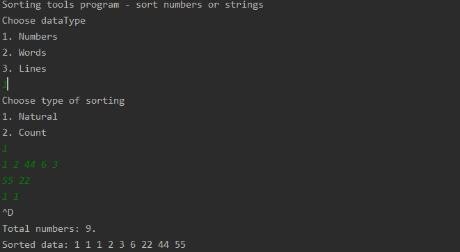
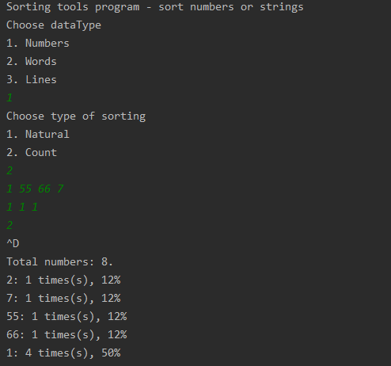

## About
A project that allows the user to sort a specific type of data (numbers, words, lines). The user himself enters the data type and sorting type (natural order or counting).

## Illustrations

### Sort numbers natural

### Sort numbers byCount

### Sort words natural

### Sort words byCount

### Sort lines natural

### Sort lines byCount

